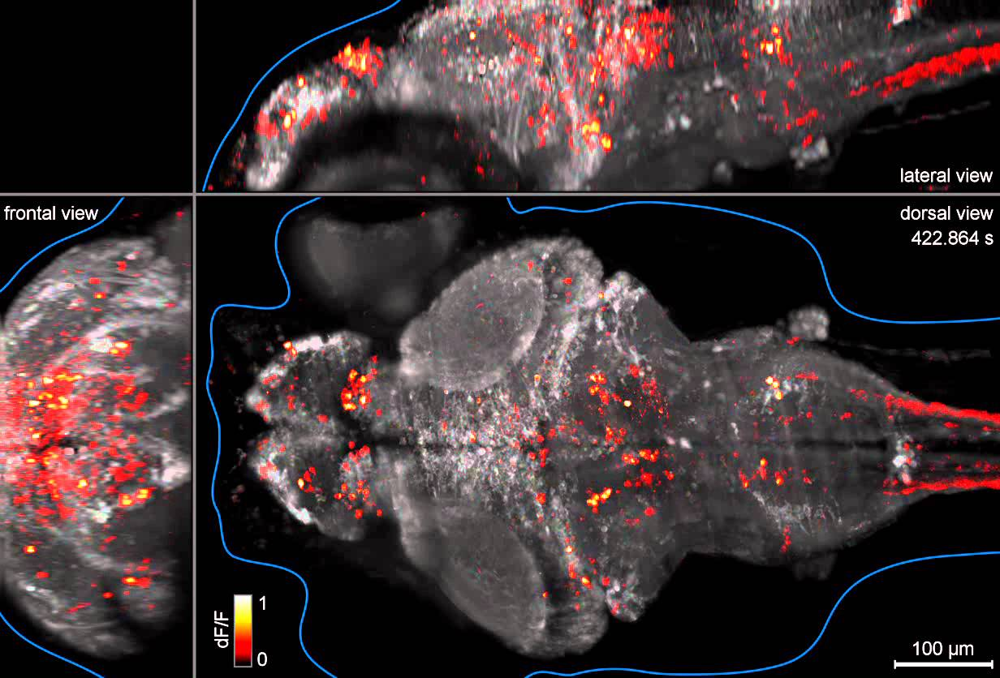
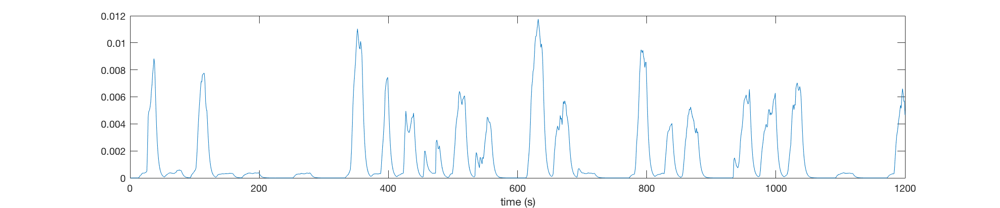
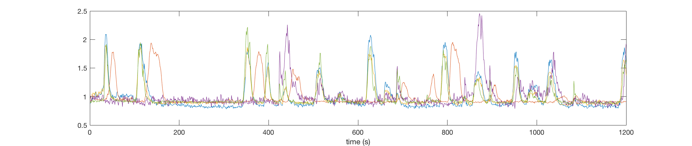
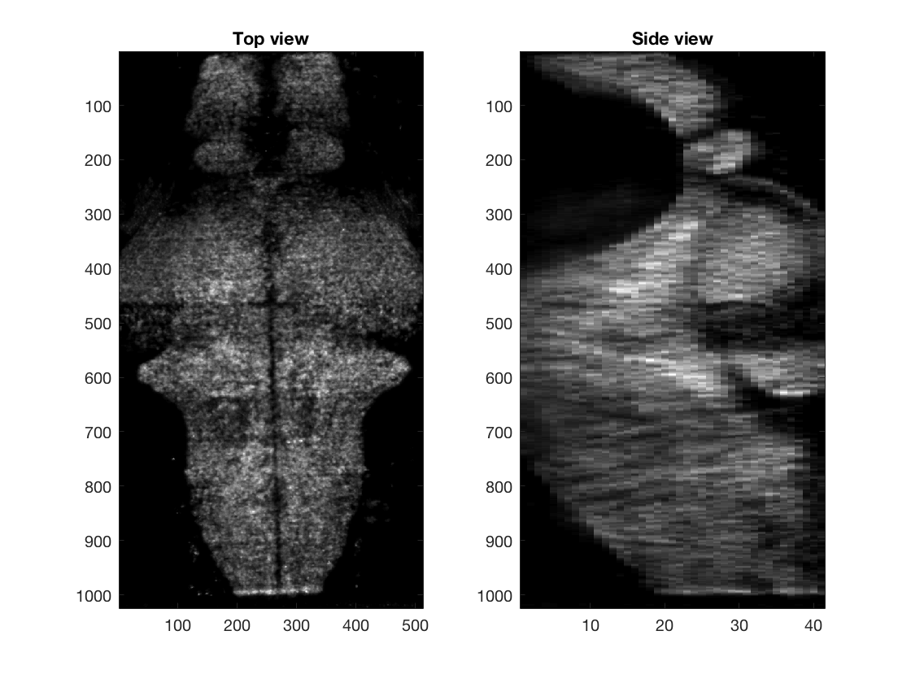
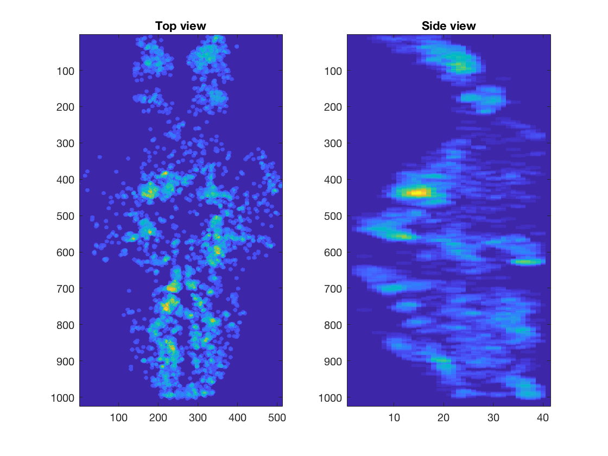
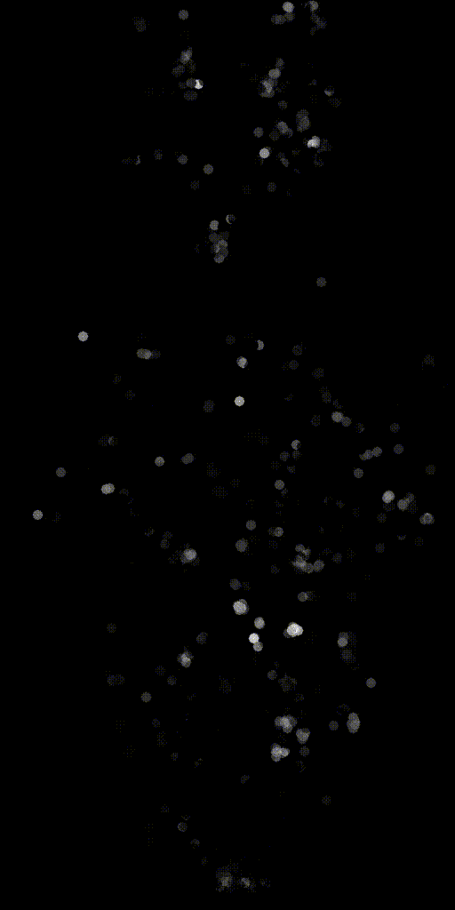
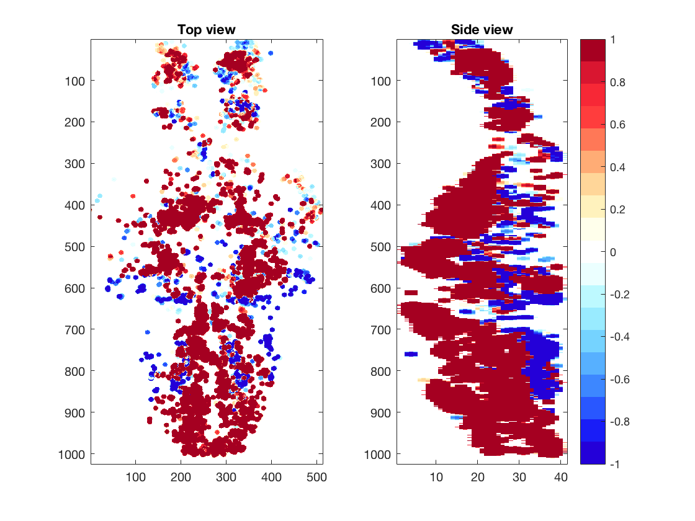

## JHU_Bootcamp: Ahrenslab

This is a github repository for the JHU bootcamp class hosted by Ahrens lab on August 22nd, 2017 in HHMI Janelia. 

Tutors: Takashi Kawashima and Mika Rubinov

The goal of this class is to learn the basics of data analysis for large-scale calcium imaging experiments. In our experiment, calcium activities of ~100,000 neurons are simuntaneously recorded in the brain of larval zebrafish, which is behaving in a virtual reality environment[ref 1-3]. 

In this class, we use Matlab as a programming environment. We use the JHU_demo.mlx for demonstration and exercise of data analyses. The imaging dataset can be downloaded from thd dropbox (https://www.dropbox.com/sh/n6f2y69s3l985bp/AADXv21TYRkZJI5U2AnAbFP5a?dl=0). 

In this experiment, the fish changes its swim pattern in response to various visual stimuli presented in the environment. We analyze how activities of individual neurons are tuned to different behavioral variables (swim pattern, visual stimuli) and how they are distributed across the brain depending on their tuning.

Below is an except of the demo code ("JHU_demo.mlx"). You can find more detailed explanation in the code.

### Data analysis

First, we load the data of behavioral variables, activities of neurons, and positions of neurons.

    root_dir='/Users/XXXXX/XXXX/data/';

    load([root_dir,'behavioral_variables.mat']);
    load([root_dir,'selected_neural_data.mat']);

This "selected_neural_data.mat" contains data of 6000 neurons which are selected from 100,000 neurons in the original imaging dataset. We use this smaller data for convenience, but if you are interested you can load "neural_data.mat" instead to analyze all imaged neurons. 

Then we plot the swim power of fish (Top) and calcium activities of 5 neurons (Bottom) during the experiment.

    figure(1)
    plot(swim_power);
    xlabel('time (s)')
    
    figure(2)
    plot(neural_response_matrix(1:5,:)');
    xlabel('time (s)')
   
  

We show 3D volume of the imaged brain (Left) or location of selected cells (Right), using projection from the top and the side. Part of the code for these plot is not shown here.

    % Top projection view
    Volume_XY=sum(Volume,3);

    % Side projection view
    Volume_XZ=sum(Volume,2);

    % Show top and side views
    figure(3)

    subplot(1,2,1);imagesc(Volume_XY);title('Top view');

    subplot(1,2,2);imagesc(squeeze(Volume_XZ));title('Side view');
    

|  |   |
|:---:|:---:|

We can also make activity movies of cells to get an intuition.

We calculate correlation coefficients between neural activities and swim patterns and plot them in a whole-brain map. You can see the correlation is different from cell to cell. Some are strongly correlated/anti-correlated to swim pattern, while others are moderately so. 

We will further practice multivariate regression, dimensionality reduction (PCA, NNMF), clustering (K-means) and other advanced methods for analyzing large-scale neural activity datasets.

### References:

[1] Whole-brain functional imaging at cellular resolution using light-sheet microscopy.
    Ahrens MB, Orger MB, Robson DN, Li JM, Keller PJ; Nature Methods. 
    2013 May;10(5):413-20. doi: 10.1038/nmeth.2434

[2] Mapping brain activity at scale with cluster computing.
    Freeman J, Vladimirov N, Kawashima T, Mu Y, Sofroniew NJ, Bennett DV, Rosen J, Yang C, Looger LL, Ahrens MB
    Nature Methods. 2014 Jul 27;11(9):941-950. doi: 10.1038/nmeth.3041

[3] Light-sheet functional imaging in fictively behaving zebrafish.
    Vladimirov N, Mu Y, Kawashima T, Bennett DV, Yang C, Looger LL, Keller PJ, Freeman J, Ahrens MB
    Nature Methods. 2014 Jul 27;11(9):883-4. doi: 10.1038/nmeth.3040
